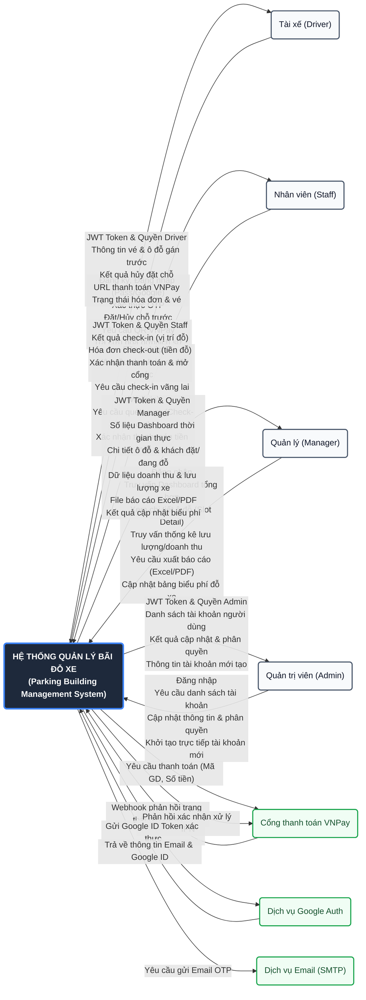

# Sơ đồ ngữ cảnh (Context Diagram - DFD Level 0)
## Dự án: Hệ thống Quản lý Bãi đỗ xe (Parking Building Management System)

Tài liệu này thiết kế sơ đồ ngữ cảnh (DFD Level 0) mô tả sự tương tác giữa Hệ thống Quản lý Bãi đỗ xe và các tác nhân bên ngoài (người dùng & hệ thống bên thứ ba).

---

### 1. Hệ thống chính (Main System)
*   **Tên hệ thống**: **Hệ thống Quản lý Bãi đỗ xe** (Parking Building Management System).
*   **Vai trò**: Là hộp đen trung tâm xử lý dữ liệu và điều phối toàn bộ luồng nghiệp vụ đỗ xe, thanh toán, xác thực và quản trị.
*   **Quy chuẩn DFD**: Cơ sở dữ liệu (Database) là thành phần lưu trữ nội bộ nên nằm bên trong Hệ thống chính (không vẽ thành tác nhân ngoài).

---

### 2. Các Tác nhân bên ngoài (External Entities)

Hệ thống tương tác trực tiếp với **4 tác nhân con người** (vai trò người dùng) và **3 hệ thống bên thứ ba**:
1.  **Tài xế (Driver)**: Khách hàng sử dụng dịch vụ đỗ xe (đặt chỗ, thanh toán, tra cứu lịch sử).
2.  **Nhân viên bãi xe (Staff)**: Người vận hành tại cổng vào/ra (quét check-in, check-out và thu tiền mặt).
3.  **Quản lý (Manager)**: Người theo dõi doanh thu, lưu lượng xe và điều chỉnh biểu phí đỗ xe.
4.  **Quản trị viên (Admin)**: Người quản trị phân quyền người dùng và tạo lập tài khoản vận hành.
5.  **Cổng thanh toán VNPay**: Hệ thống thanh toán trực tuyến bên thứ ba xử lý giao dịch điện tử.
6.  **Dịch vụ Google Auth**: Dịch vụ xác thực tài khoản bên ngoài bằng Google ID Token.
7.  **Dịch vụ gửi Email (SMTP)**: Hệ thống bên thứ ba đảm nhận việc gửi mã OTP kích hoạt tài khoản.

---

### 3. Luồng dữ liệu chi tiết (Data Flows)

| Tác nhân | Luồng dữ liệu đi VÀO (Inputs) | Luồng dữ liệu đi RA (Outputs) |
| :--- | :--- | :--- |
| **Tài xế (Driver)** | - Yêu cầu đăng ký, OTP<br>- Đăng nhập (Pass/Google ID Token)<br>- Yêu cầu đặt chỗ / Hủy đặt chỗ<br>- Yêu cầu tạo liên kết thanh toán VNPay<br>- Yêu cầu tra cứu vé & lịch sử đỗ xe | - JWT Token định danh & quyền Driver<br>- Thông tin vé đặt trước & vị trí ô đỗ (hiệu lực 15 phút)<br>- Kết quả hủy đặt chỗ<br>- Đường dẫn (URL) thanh toán VNPay<br>- Danh sách vé & trạng thái hóa đơn |
| **Nhân viên (Staff)** | - Thông tin đăng nhập (Tài khoản/Mật khẩu)<br>- Yêu cầu check-in xe đã đặt trước<br>- Yêu cầu check-in xe vãng lai (Walk-in)<br>- Yêu cầu quét xe ra & tính tiền (Check-out)<br>- Xác nhận thanh toán tiền mặt | - JWT Token & phân quyền Staff<br>- Kết quả check-in (vị trí đỗ của xe)<br>- Hóa đơn check-out (Tổng thời gian đỗ, số tiền cần thu)<br>- Xác nhận thanh toán & lệnh mở barrier |
| **Quản lý (Manager)** | - Thông tin đăng nhập<br>- Yêu cầu Dashboard tổng hợp thời gian thực<br>- Yêu cầu chi tiết ô đỗ xe (Slot ID)<br>- Truy vấn thống kê lưu lượng xe/doanh thu<br>- Yêu cầu xuất báo cáo (Excel/PDF)<br>- Yêu cầu cập nhật biểu phí đỗ xe | - JWT Token & phân quyền Manager<br>- Số liệu Dashboard & Sơ đồ trạng thái slot đỗ<br>- Chi tiết trạng thái ô đỗ & thông tin khách đặt<br>- Dữ liệu doanh thu & lưu lượng xe<br>- Tệp báo cáo tải về (Excel/PDF)<br>- Kết quả cập nhật biểu phí thành công |
| **Quản trị viên (Admin)** | - Thông tin đăng nhập<br>- Yêu cầu danh sách tài khoản hoạt động<br>- Yêu cầu cập nhật thông tin & phân quyền<br>- Yêu cầu tạo trực tiếp tài khoản mới | - JWT Token & phân quyền Admin<br>- Danh sách toàn bộ tài khoản người dùng<br>- Kết quả phân quyền thành công<br>- Thông tin tài khoản mới tạo |
| **Cổng thanh toán VNPay** | - Webhook phản hồi trạng thái giao dịch (IPN Callback) | - Yêu cầu thanh toán (Mã GD, Số tiền)<br>- Phản hồi xác nhận xử lý IPN (`RspCode`) |
| **Dịch vụ Google Auth** | - Trả về thông tin User (Email, Google ID) sau khi xác minh | - Gửi Google ID Token để yêu cầu xác thực |
| **Dịch vụ gửi Email (SMTP)** | - (Không có luồng vào trực tiếp) | - Yêu cầu gửi Email chứa OTP xác thực tài khoản |

---

### 4. Sơ đồ ngữ cảnh Mermaid.js (DFD Level 0)

Dưới đây là mã nguồn biểu đồ dạng **graph LR** (từ trái qua phải) giúp hiển thị cân đối và rõ nét các luồng dữ liệu:



---

### Cách xem biểu đồ trực quan
1.  **Sử dụng VS Code**: Cài đặt extension **Markdown Preview Mermaid Support** để xem trực tiếp biểu đồ khi nhấn `Ctrl + Shift + V` trong file `.md`.
2.  **Sử dụng GitHub/Notion**: Khi bạn đẩy mã nguồn lên GitHub hoặc dán vào trang Notion, biểu đồ Mermaid sẽ tự động được hiển thị dưới dạng đồ họa trực quan.
3.  **Trình duyệt web**: Truy cập [mermaid.live](https://mermaid.live/) và dán mã nguồn trong khối ````mermaid ```` ở trên vào khung soạn thảo.
